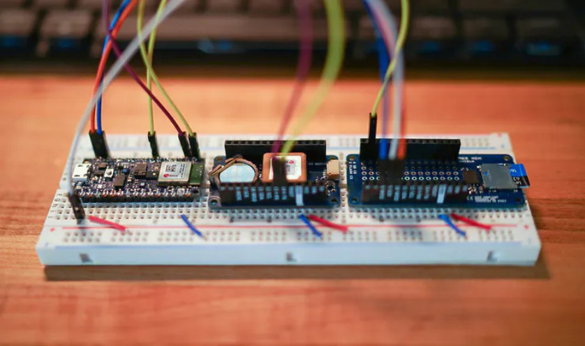
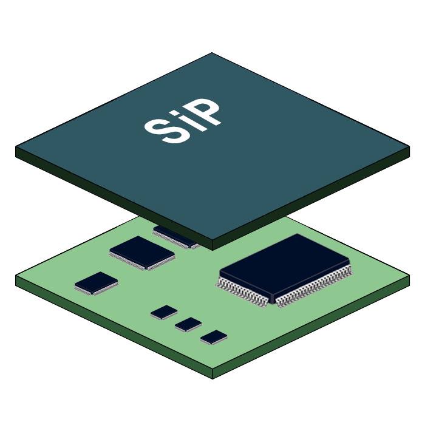
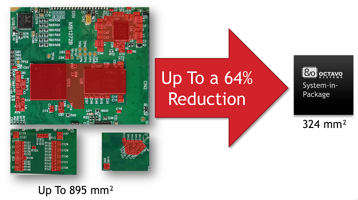
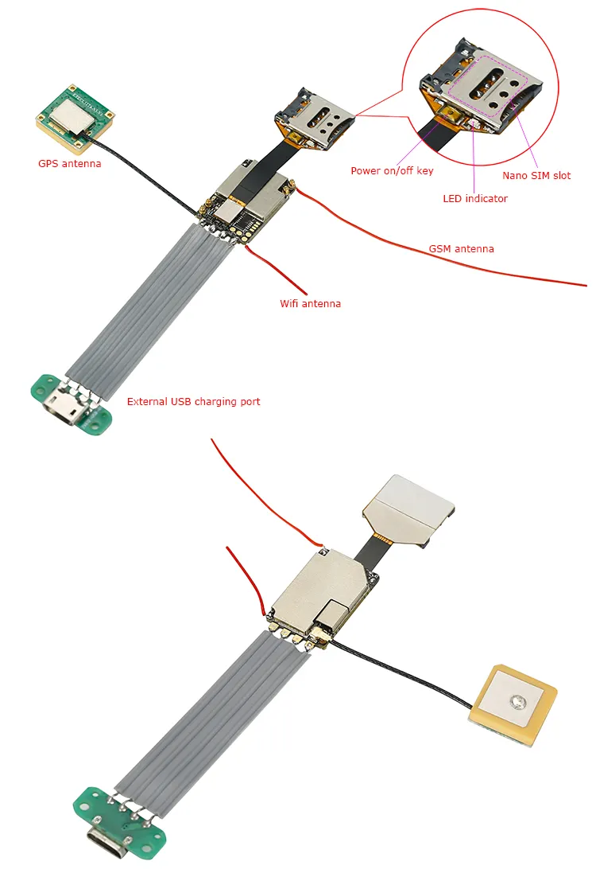

### Pilotcase Amilu

Amilu is a family-owned company with a vision to develop a small, real-time GPS tracker that leverages either LoRa (Long Range) or NB-IoT (Narrowband IoT) technologies. 
This device needs to be as small as possible, and aims to integrate seamlessly into an ecosystem of other security-related devices, providing enhanced tracking and location services. 
Due to confidentiality agreements and the sensitive nature of the project, further details remain undisclosed.

### Building a Real-Time GPS Tracker with NB-IoT

Creating a real-time GPS tracker with NB-IoT and an accelerometer, as compact as a coin, requires specialized equipment. Initially, we need to develop a prototype using development boards.

The main requirements for the device are:
* Wireless charging via a docking station
* Activation upon being lifted from the docking station (utilizing the accelerometer)
* Transmission of GPS coordinates every 10 to 60 seconds
* Battery life exceeding 12 hours

#### What is a GPS Tracker and what is NB-IoT?

1. **GPS Tracker**: This is an electronic device that uses the Global Positioning System (GPS) to determine and continuously report its precise location. By triangulating signals from at least four satellites, the device can calculate its position in terms of latitude and longitude. The GPS data is used for various purposes, such as navigation, asset tracking, or personal safety.

2. **NB-IoT (Narrowband IoT)**: NB-IoT is a low-power Wide Area Network (LPWAN) technology that facilitates communication between devices and the internet, especially for applications that transmit small amounts of data infrequently. It is designed to provide coverage over long distances and through physical obstructions, using minimal power.

3. **Accelerometer**: An accelerometer is a device that measures acceleration forces. In GPS trackers, it is used to detect movement and stillness, which can contribute to energy efficiency by only activating GPS and data transmission when movement is detected.

#### Key Steps to Build a Small GPS Tracker

1. **Component Selection**:
   - **GPS Module**: This component is responsible for obtaining positional data. Modern GPS modules can be very compact and offer high precision.
   - **NB-IoT Module**: Choose a module that best fits the coverage and power requirements of your application.
   (Note: GPS + GNSS module below includs both NB-IoT and GPS)
   - **Microcontroller Unit (MCU)**: This acts as the brain of the device, responsible for processing data from the GPS module, handling communication with the NB-IoT module, and processing signals from the accelerometer.
   - **Accelerometer**: This component adds motion detection, which can be used to control when the device should enter low-power mode or activate GPS tracking.
   - **Battery**: Choose a battery that can provide sufficient power for the expected lifetime of the device, often aiming to operate for months or even years on a single charge.

| Image                                                                                                               | Name                                      | Price   | Description                                                                                                                                            | Link                                                                                                                                                      |
|---------------------------------------------------------------------------------------------------------------------|-------------------------------------------|---------|--------------------------------------------------------------------------------------------------------------------------------------------------------|-----------------------------------------------------------------------------------------------------------------------------------------------------------|
|            | ADXL345 Accelerometer                     | 59 SEK  | The ADXL345 is a small, low-power accelerometer with 13-bit resolution that senses movement in three directions. The sensor measures up to ±16g and detects motions as small as 0.04g.          | [Link](https://www.electrokit.com/adxl345-accelerometer-3-axel-monterad-pa-kort?gad_source=1)                                                            |
|  | ESP32-PICO-MINI-02U Adafruit Feather V2 med w.FL | 329 SEK | MCU                                                                                                                                                    | [Link](https://www.electrokit.com/adafruit-esp32-feather-v2)                                                                                              |
|  | SIM7080G CAT-M / NB-IoT och GNSS          | 526 SEK | ...                                                                                                                                                   | [Link](https://www.elfa.se/sv/sim7080g-cat-nb-iot-och-gnss-tradloes-kommunikationsenhet-m5stack-u137/p/30344657?ext_cid=shgooaqsesv-Shopping-PerformanceMax-CSS)  |

After building a development board with all the selected components the result of this step would look something like this. 

2. **Miniaturization Techniques**:
  - Use System-in-Package (SiP) or System-on-Chip (SoC) solutions where possible to integrate multiple components on a single chip. SiP technology enables the packaging of diverse semiconductor components into a single module, incorporating processor cores, memory, power management, and specialized circuits. This reduces device size, enhances performance by minimizing interconnect lengths, reduces power consumption, and improves efficiency, making it particularly beneficial for compact applications like wearable technology and mobile devices. 

<table>
  <tr>
    <td></td>
    <td></td>
  </tr>
</table>

   - Additionally, designing custom PCBs can efficiently organize components to minimize the device's overall size. Custom PCBs are tailored to the specific needs of an application, allowing for unique placement and orientation of components beyond standard layouts. This creates more compact devices, potential cost savings, and optimized performance through improved signal paths and reduced interference. Utilizing multilayer boards, appropriate materials, and optimizing the layout for signal flow and component placement are crucial techniques. Advanced software tools assist in designing these custom PCBs by simulating electromagnetic fields and thermal characteristics, leading to a more efficient and reliable final product.

   

3. **Power Management**:
   - Develop a power profile that optimizes when the device is fully active versus in low-power mode. The device should spend the majority of its time in its lowest power state, only activating upon motion signals detected by the accelerometer.
   - Implement efficient power-saving algorithms and components such as low-dropout regulators and efficient battery management systems.

   

It's important to note that in our IoT lab, we are currently only able to develop prototypes using development boards. This means we do not have the capability to produce miniaturized versions using technologies such as SiP and SoC. 
Instead, we focus on proving the concept and demonstrating functionality before the client potentially taking the next steps with external partners for miniaturization.

