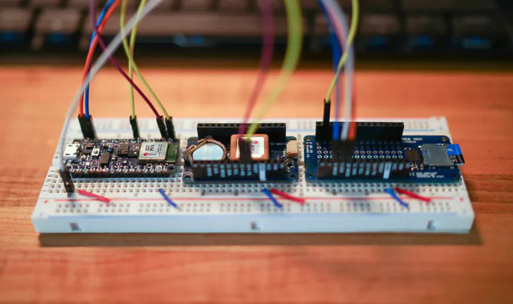
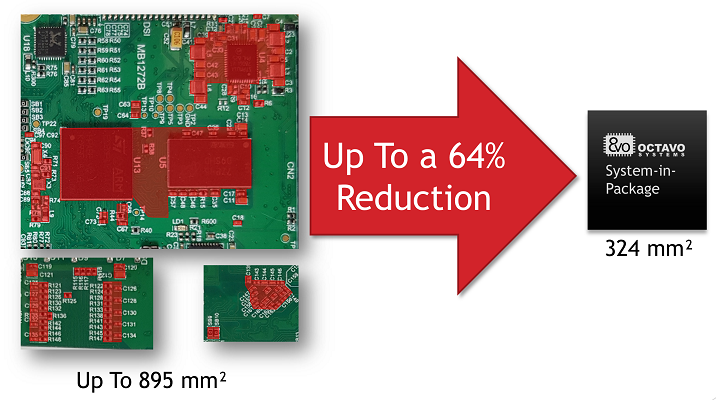
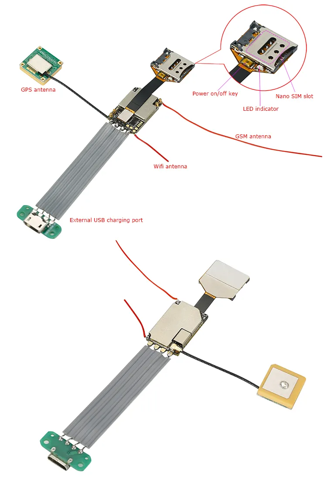

#### Key Steps for developing a new device

1. **Development board**
   
After building a development board with all the selected components the result of this step would look something like this. 

2. **Miniaturization Techniques**:
  - Use System-in-Package (SiP) or System-on-Chip (SoC) solutions where possible to integrate multiple components on a single chip. SiP technology enables the packaging of diverse semiconductor components into a single module, incorporating processor cores, memory, power management, and specialized circuits. This reduces device size, enhances performance by minimizing interconnect lengths, reduces power consumption, and improves efficiency, making it particularly beneficial for compact applications like wearable technology and mobile devices. 

<table>
  <tr>
    <td></td>
    <td></td>
  </tr>
</table>

   - Additionally, designing custom PCBs can efficiently organize components to minimize the device's overall size. Custom PCBs are tailored to the specific needs of an application, allowing for unique placement and orientation of components beyond standard layouts. This creates more compact devices, potential cost savings, and optimized performance through improved signal paths and reduced interference. Utilizing multilayer boards, appropriate materials, and optimizing the layout for signal flow and component placement are crucial techniques. Advanced software tools assist in designing these custom PCBs by simulating electromagnetic fields and thermal characteristics, leading to a more efficient and reliable final product.

   

3. **Power Management**:
   - Develop a power profile that optimizes when the device is fully active versus in low-power mode. The device should spend the majority of its time in its lowest power state, only activating upon motion signals detected by the accelerometer.
   - Implement efficient power-saving algorithms and components such as low-dropout regulators and efficient battery management systems.

   

It's important to note that in our IoT lab, we are currently only able to develop prototypes using development boards. This means we do not have the capability to produce miniaturized versions using technologies such as SiP and SoC. 
Instead, we focus on proving the concept and demonstrating functionality before the client potentially taking the next steps with external partners for miniaturization.
